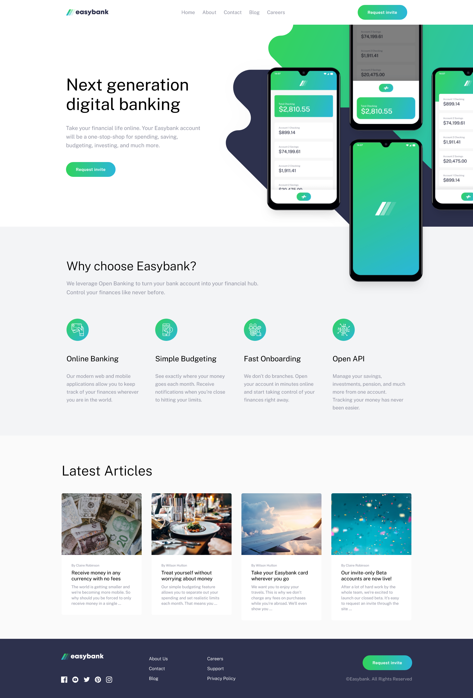

# Frontend Mentor - Easybank landing page solution

This is a solution to the [Easybank landing page challenge on Frontend Mentor](https://www.frontendmentor.io/challenges/easybank-landing-page-WaUhkoDN). Frontend Mentor challenges help you improve your coding skills by building realistic projects. 

## Table of contents

- [Overview](#overview)
  - [The challenge](#the-challenge)
  - [Screenshot](#screenshot)
  - [Links](#links)
- [My process](#my-process)
  - [Built with](#built-with)
- [Author](#author)

**Note: Delete this note and update the table of contents based on what sections you keep.**

## Overview

### The challenge

Users should be able to:

- View the optimal layout for the site depending on their device's screen size
- See hover states for all interactive elements on the page

### Screenshot

### Links

- Frontend Mentor solution URL: [Link](https://www.frontendmentor.io/solutions/easybank-landing-page-build-w-angular-sass-and-typescript-W5jfSOtC57)
- Live Site URL: [Link](https://easybank-blond.vercel.app/)

## My process

### Built with

- Angular
- SCSS
- TypeScript
- CSS Grid
- Mobile-first workflow

## Author

- Frontend Mentor - [@danielmrz-dev](https://www.frontendmentor.io/profile/danielmrz-dev)
- LinkedIn - [@danielmrz-dev](https://www.linkedin.com/in/danielmrz-dev/)
